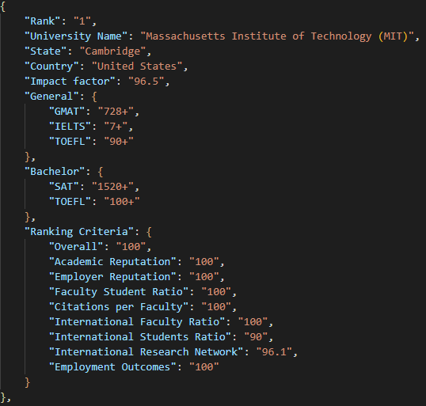
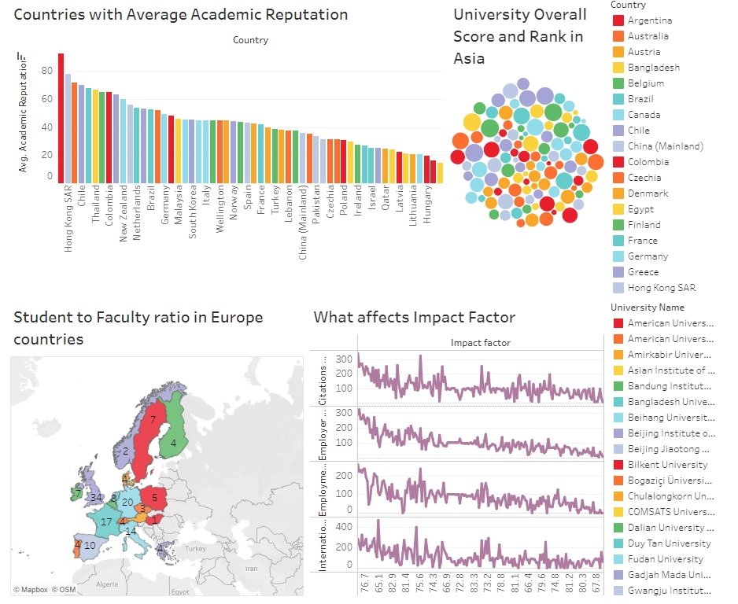

# Project Description

This is a data analytics and automation project. This project's goal is to discover critical insights concerning university rankings.

## Tools 🔧

- Selenium
- Pandas
- SQL Alchemy
- Tableu Public

## Data Collection 📚

The information was gathered from the official website for the QS University global rankings. The tool selenium was used to collect all the data. A total of 500 university records were scraped. The items that were scraped include:

- Country of University
- State of Univerity
- University Name
- Impact Factor
- General Admission requirements
- Bachelor Admission requirements
- Ranking Criteria :
  - Academic Reputation
  - Employer Reputation
  - Faculty Student Ratio
  - Citations per Faculty
  - International Faculty Ratio
  - International Students Ratio
  - International Research Network
  - Employment Outcomes

## Data Processing

Three different csv files were created from the collected data. Then, after each file had been processed independently, three files were joined together into a single file using SQL joins. The data was then cleaned, properly formatted for each appropriate data type, and the column names were adjusted. Python script was used to remove unwanted outliers.

## What does the data look like after scraping

All the data is stored in a json file but later a CSV file is generated using SQL joins and pandas dataframe.

## Data Analysis 🚀

The following questions were answered using data analysis in Tableu.

- Countries with Average Academic Reputation
- University Overall Score and Rank in Asia
- Student to Faculty ratio in Europe countries
- What factors affects Impact Factor

## Dashboard in Tableu

Find the dashboard
[here](https://public.tableau.com/app/profile/tazin.morshed1498/viz/QS-WorldRankingDashboard/Dashboard1?publish=yes) 🔥🔥

## For any queries

